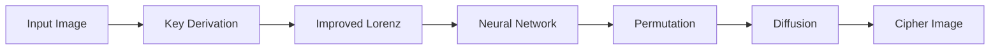

## ChaosNet-IE: Neural Network Optimized Chaotic Image Encryption

[](README.md) [](README_CN.md)

> A high-security image encryption scheme combining an improved Lorenz chaotic system and neural network optimization.

   

## Overview
ChaosNet-IE implements the core ideas from the paper (CN) "基于神经网络优化混沌系统的图像加密算法": generate raw chaotic sequences from an improved Lorenz system, refine them via a BP neural network, then perform pixel permutation and diffusion for robust encryption.

## Features
- Neural network assisted enhancement of chaotic sequence quality
- Improved Lorenz dynamics for stronger randomness
- Two-stage processing: permutation + diffusion
- Key derivation via SHA-384(image bytes) -> initial conditions (high key sensitivity)
- Near-ideal entropy (~8.0) and low adjacent-pixel correlation after encryption

## Project Structure
```
ChaosNet-IE/
├── keys/
│   ├── sequences.npz          # Trained/optimized chaotic sequences
│   └── initial_values.txt     # Initial Lorenz parameters
├── output/
│   ├── encrypted.png
│   └── decrypted.png
├── encrypt.py                 # Encryption script
├── decrypt.py                 # Decryption script
├── demo.py                    # One-click demo
├── lena.png                   # Test image
└── README.md / README_CN.md
```

## Quick Start
### Install Dependencies
```bash
pip install numpy opencv-python
```
### One-Click Demo
```bash
python demo.py
```
Performs: encryption → decryption → statistics output.

### Encrypt Only
```bash
python encrypt.py
```
Outputs: `output/encrypted.png`, `keys/sequences.npz`, `keys/initial_values.txt`

### Decrypt Only
```bash
python decrypt.py
```
Outputs: `output/decrypted.png`

## Algorithm Outline
1. Improved Lorenz system generates chaotic sequences (with warm-up iterations)
2. Sequence normalization to [0,1]
3. BP neural network (≈10 hidden neurons) refines sequence quality
4. Pixel permutation (index scrambling)
5. Block-wise diffusion (XOR / additive mapping)
6. Produce final cipher image

### Improved Lorenz Variant
```
dx/dt = a(y - x)
dy/dt = bx - xz + y
dz/dt = 200x^2 + 0.01·e^(xy) - cz
```

### Conceptual Flow


## Security Indicators (Example)
| Metric | Plain | Encrypted | Note |
|--------|-------|-----------|------|
| Entropy | ~7.0 | ~8.0 | Near ideal randomness |
| Adjacent Corr. | High | <0.001 | Spatial decorrelation |
| Pixel Change Rate | 0% | >99% | Strong diffusion |
| Histogram | Structured | Uniform | Resists frequency analysis |

## Visualization
| Plain | Encrypted | Decrypted |
|-------|-----------|-----------|
|  |  |  |

## Key & Sequence Processing
- SHA-384 over raw image bytes -> parse into initial conditions
- 1000 warm-up iterations ensure chaotic regime
- BP network (tanh hidden + linear output) fits/refines series
- Derived indices drive permutation & diffusion vectors

## Usage Notes
1. Keep `keys/` files safe; they are required for decryption
2. Current implementation targets grayscale images (RGB extension: per-channel processing)
3. Changing the input image requires regenerating key materials

## Reference (Chinese Paper)
Paper: 基于神经网络优化混沌系统的图像加密算法 (计算机系统应用)
Link: https://www.c-s-a.org.cn/1003-3254/7578.html

## Roadmap (Optional Ideas)
- Color image direct support
- GPU acceleration for sequence generation
- Configurable network depth
- Benchmark suite (speed / entropy / NPCR / UACI)

## License
Academic / research only. Not intended for commercial deployment.

---
For the Chinese version, click the 中文 badge at the top.